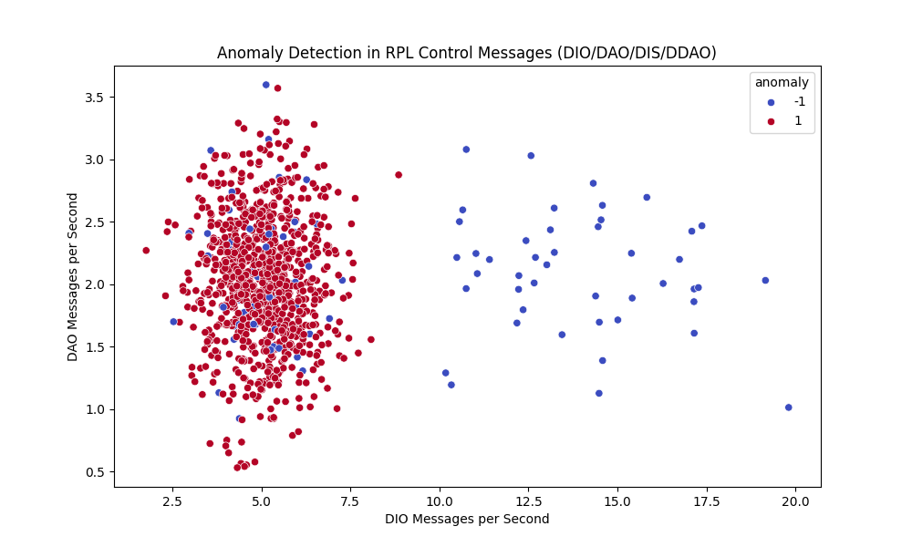

# RPL Intrusion Detection System (IDS)

A Python-based Intrusion Detection System (IDS) to detect **DDAO** (Dropped Destination Advertisement Object) and other RPL control message attacks (DIO/DAO/DIS) in IoT networks. This project is inspired by the research paper: *A Lightweight Distributed Detection Algorithm for DDAO Attack on RPL Routing Protocol in Internet of Things* (Sheibani et al., 2022).

## Features
- Generates a synthetic dataset for RPL control messages (DIO, DAO, DIS, and DDAO).
- Detects anomalies using the **Isolation Forest** algorithm.
- Visualizes anomalies with a scatter plot and saves results to a CSV file.
- Lightweight and suitable for resource-constrained IoT environments.

## Project Structure

## Requirements
- Python 3.8+
- Install dependencies: `pip install -r requirements.txt`

## How to Run
1. Clone the repository: `git clone <your-repo-url>`
2. Navigate to the project directory: `cd rpl-ids-project`
3. Install dependencies: `pip install -r requirements.txt`
4. Run the IDS: `python main.py`

The script will:
- Generate a synthetic dataset (`data/rpl_control_messages.csv`).
- Detect anomalies using Isolation Forest.
- Save a report of anomalies (`output/rpl_anomalies_report.csv`).
- Generate a scatter plot (`output/anomaly_plot.png`).

## Results
The scatter plot below shows detected anomalies (red) vs. normal messages (blue):

## Author
[Your Name]

## Inspiration
This project is based on the DDAO attack introduced in the paper: *A Lightweight Distributed Detection Algorithm for DDAO Attack on RPL Routing Protocol in Internet of Things* by Sheibani et al. (Pervasive and Mobile Computing, 2022).

## License
MIT License